# Enumeration
Enumeration Techniques

# Explore Google hacking and enumeration 

# AIM:

To use Google for gathering information and perform enumeration of targets

## STEPS:

### Step 1:

Install kali linux either in partition or virtual box or in live mode

### Step 2:

Investigate on the various Google hacking keywords and enumeration tools as follows:

### Step 3:
Open terminal and try execute some kali linux commands

## Pen Test Tools Categories:  

Following Categories of pen test tools are identified:
Information Gathering.

Google Hacking:

Google hacking, also known as Google dorking, is a technique that involves using advanced operators to perform targeted searches on Google. These operators can be used to search for specific types of information, such as sensitive data that may have been inadvertently exposed on the web. Here are some advanced operators that can be used for Google hacking:

site: This operator allows you to search for pages that are within a specific website or domain. For example, "site:example.com" would search for pages that are on the example.com domain.
Following searches for all the sites that is in the domain amazon.in
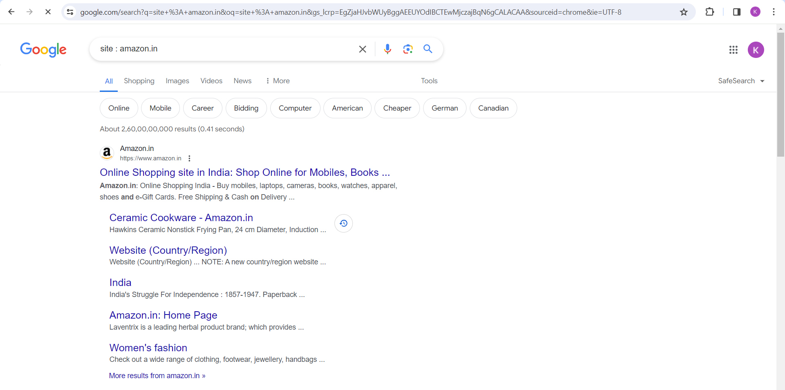

filetype: This operator allows you to search for files of a specific type. For example, "filetype:pdf" would search for all PDF files.
Following searches for pdf file in the domain amazon.in
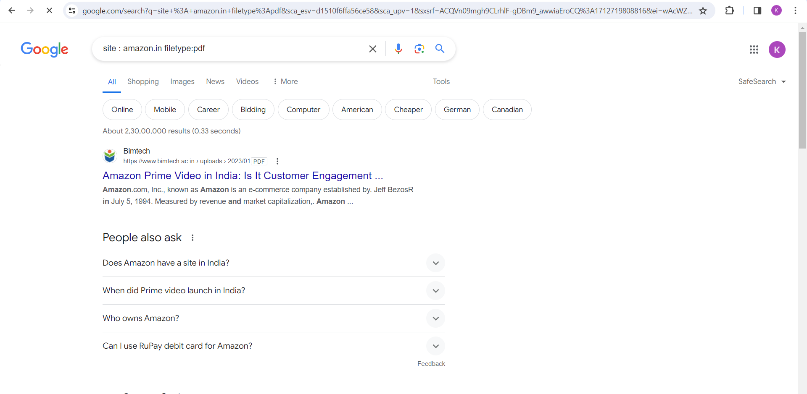

intext: This operator allows you to search for pages that contain specific text within the body of the page. For example, "intext:password" would search for pages that contain the word "password" within the body of the page.
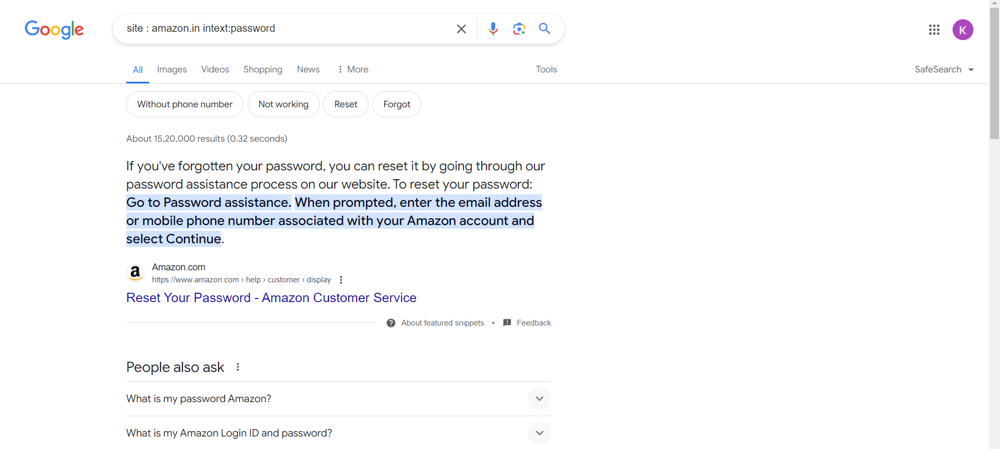

inurl: This operator allows you to search for pages that contain specific text within the URL. For example, "inurl:admin" would search for pages that contain the word "admin" within the URL.
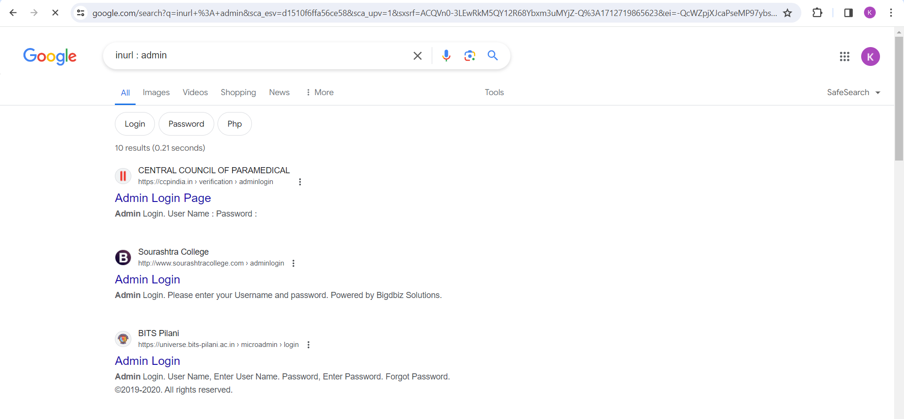

intitle: This operator allows you to search for pages that contain specific text within the title tag. For example, "intitle:index of" would search for pages that contain "index of" within the title tag.
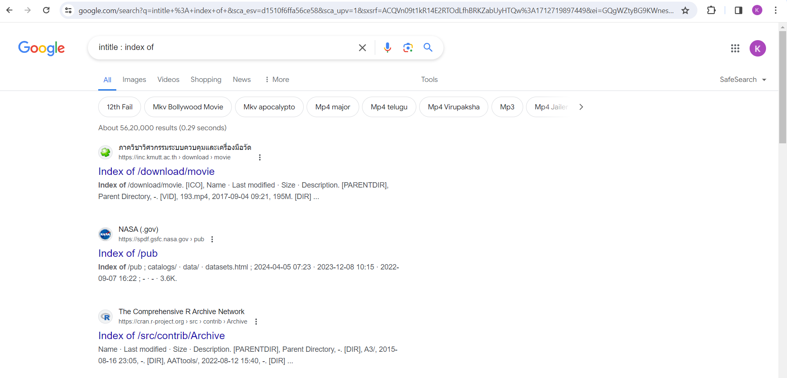

link: This operator allows you to search for pages that link to a specific URL. For example, "link:example.com" would search for pages that link to the example.com domain.
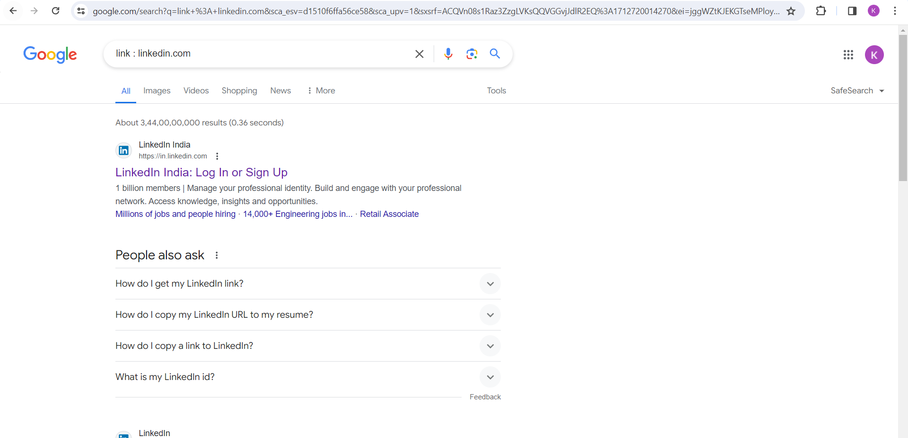

cache: This operator allows you to view the cached version of a page. For example, "cache:example.com" would show the cached version of the example.com website.

 
# DNS Enumeration

## DNS Recon
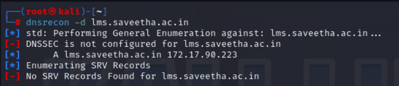

## dnsenum
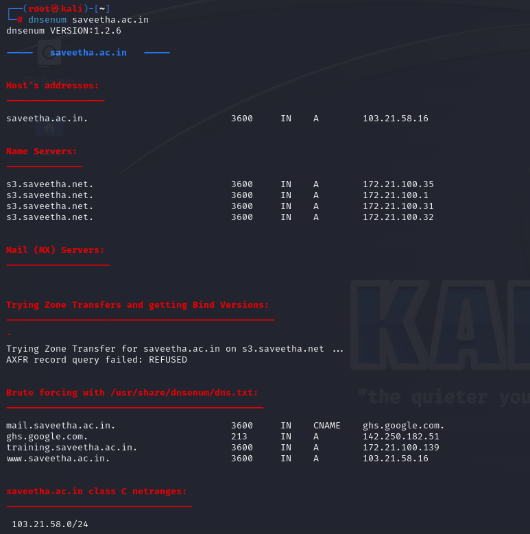

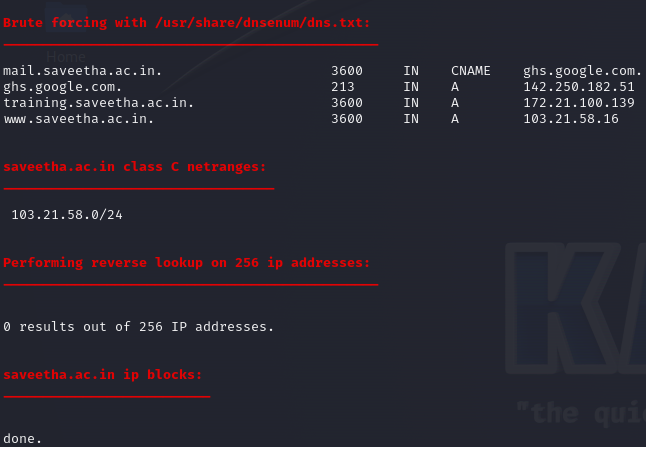

## smtp-user-enum
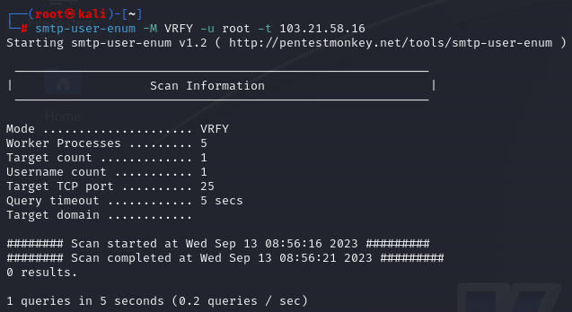

## nmap –script smtp-enum-users.nse <hostname>
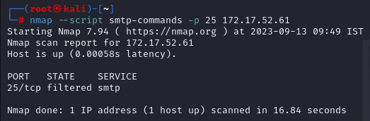

## RESULT:
The Google hacking keywords and enumeration tools were identified and executed successfully

